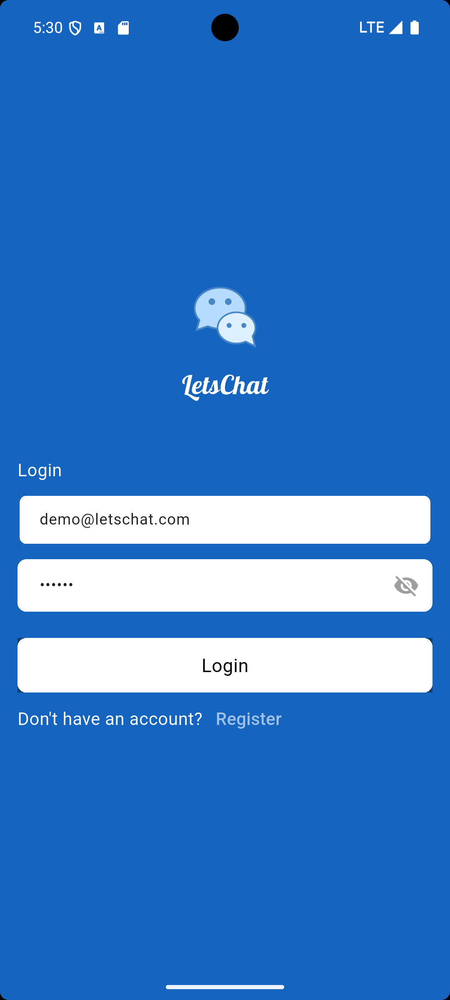
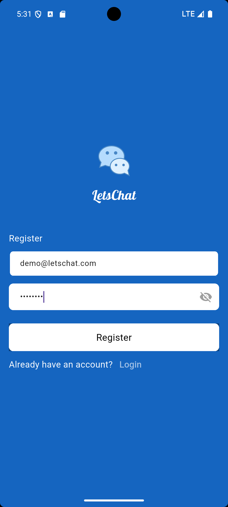
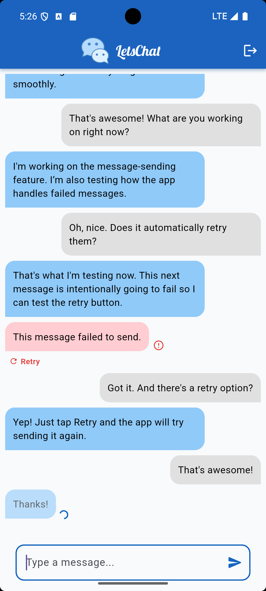
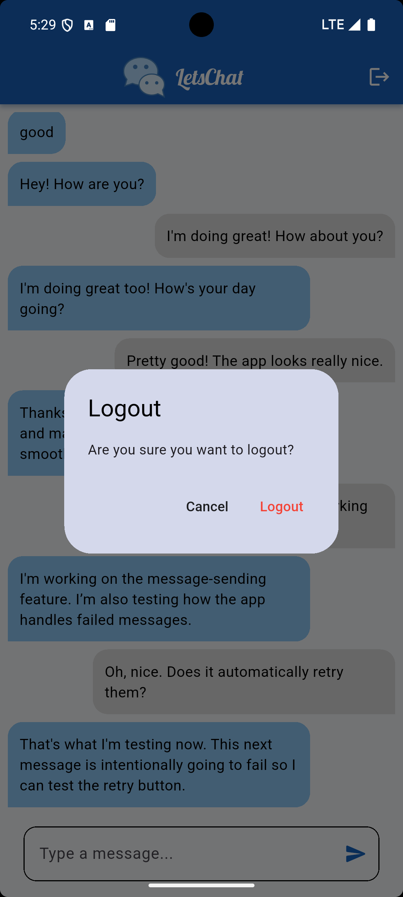

# Lets Chat


Lets Chat is a lightweight, Flutter-based real-time chat application built with a clean, layered architecture. It demonstrates a practical organization for production-ready apps using use-cases, repositories, and BLoC/Cubit state management. The project integrates with Firebase for authentication and Firestore for message persistence.

<p align="center">
  
  
  
  
</p>

Key goals
- Clear separation between presentation, domain, and data layers
- Predictable authentication flow (AuthCubit + AuthGate)
- Testable use-cases and repositories (fully mockable — no Firebase needed to run the test suite)
- Simple, responsive UI components for chat messaging

Features
- Email/password authentication (Firebase Auth)
- Logout with a confirmation dialog
- Real-time chat messages (Cloud Firestore snapshots)
- Optimistic UI for sending: a message appears instantly (faded, with a small
  spinner) and is reconciled once Firestore confirms the write — or marked
  with a red "failed to send" state if the write fails, instead of silently
  disappearing
- Cursor-based pagination for older messages, with a loading indicator at
  the top of the chat
- Firestore Security Rules (`firestore.rules`) enforcing that only
  authenticated users can read/write, and that a user can only ever send a
  message as themselves
- Clean Architecture: `domain_layer`, `data_layer`, `presentation_layer`

Architecture overview
- presentation_layer: UI, widgets, and Cubits (`AuthCubit`, `ChatCubit`)
- domain_layer: Entities and UseCases (e.g., `GetCurrentUserUseCase`, `GetMessagesUseCase`)
- data_layer: Remote datasources and repository implementations (Firebase integration)

Authentication flow
- `AuthCubit` is the single source of truth for authentication state. It exposes `AuthState` and an `initialize()` method to restore sessions.
- `AuthGate` listens to `AuthState` and decides whether to show `LoginPage` or the authenticated app (it also creates `ChatCubit`).
- `ChatPage` receives the authenticated `UserEntity` from `AuthGate` and does not directly depend on Firebase APIs.
- Logging out goes through a confirmation dialog (`_confirmLogout` in `ChatPage`) before `AuthCubit.logout()` is called, to avoid an accidental tap signing the user out.

Timestamp semantics
- This project uses Firestore server timestamps as the canonical source of truth for message ordering and persisted `createdAt` fields. See `TIMESTAMP_SEMANTICS.md` for details on how this is reconciled with the optimistic (locally-created) timestamp used before a message is confirmed.

Getting started

Prerequisites
- Flutter SDK (stable) installed and on your PATH
- A Firebase project with Firestore and Authentication (Email/Password provider) enabled

Local setup
1. Clone the repository:

	git clone <https://github.com/kawtharrashid/lets_chat>
	cd lets_chat

2. Install dependencies:

```bash
flutter pub get
```

3. Configure Firebase:
- Generate `lib/core/firebase_options.dart` via the [FlutterFire CLI](https://firebase.google.com/docs/flutter/setup) (`flutterfire configure`), and include platform-specific configuration files (`google-services.json` for Android, `GoogleService-Info.plist` for iOS) as required.
- Note: the values in `firebase_options.dart` (API keys, app IDs, project ID) are safe to keep in source control — Firebase client configuration is not a secret; access is controlled by Firestore/Auth Security Rules, not by hiding these values.

4. Deploy the Firestore Security Rules:

```bash
firebase deploy --only firestore:rules
```

(or paste the contents of `firestore.rules` into Firebase Console → Firestore Database → Rules.)

5. Run the app:

```bash
flutter run
```

Testing
- Unit tests cover every UseCase (mocking the repository layer) and both Cubits (`AuthCubit`, `ChatCubit`) using `bloc_test` + `mocktail` — no real Firebase connection is needed to run them.
- Widget tests cover `MessageInput`'s send/disabled/pending behavior.

```bash
flutter test
```

Continuous Integration
- Every push and pull request to `main` runs `flutter analyze` and `flutter test` via GitHub Actions (`.github/workflows/ci.yml`), so a failing test or new analyzer warning is caught before merging.

Development notes
- `main.dart` wires application dependencies and provides `AuthCubit` at the root. `AuthCubit.initialize()` restores session state on startup.
- `AuthGate` is the single place that decides routing based on `AuthState`; it creates `ChatCubit` after authentication is established.
- `ChatPage` focuses on rendering and user interactions; message loading, pagination, and optimistic sending are owned by `ChatCubit`.

## Author

**Kawthar Rashid**
Flutter Developer

- GitHub: [github.com/kawtharrashid](https://github.com/kawtharrashid)
- LinkedIn: [linkedin.com/in/kawthar-rashid-811418437/](https://www.linkedin.com/in/kawthar-rashid-811418437/)
